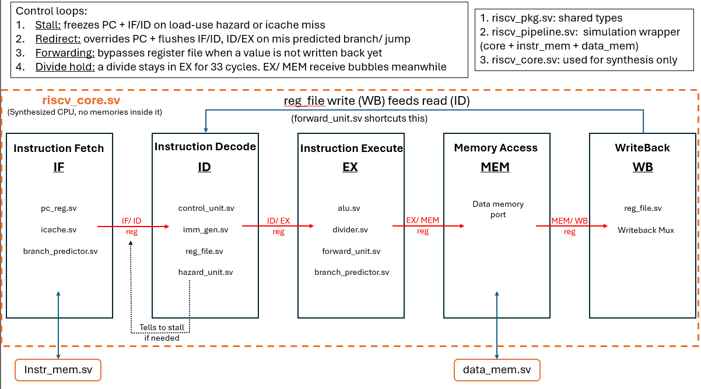
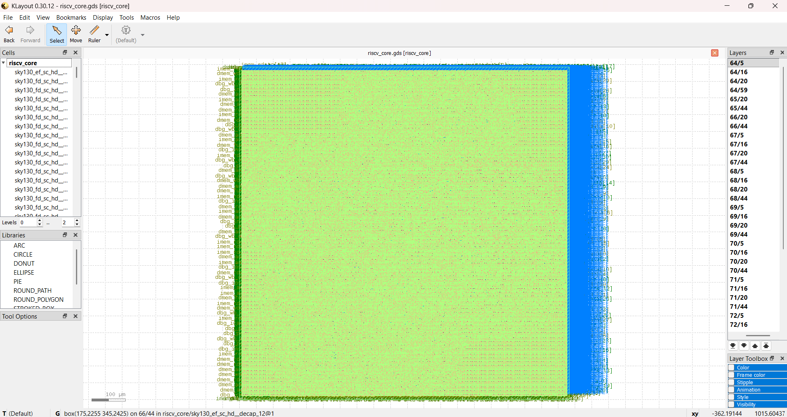
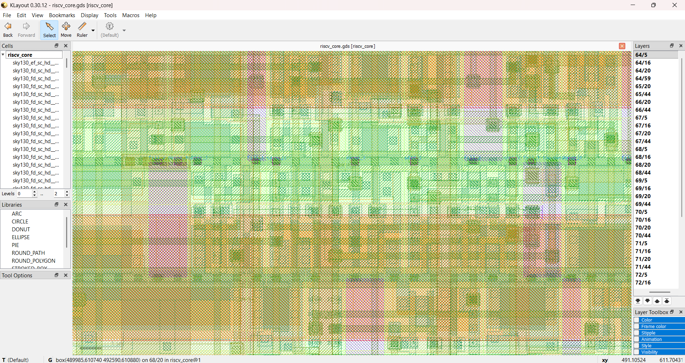

# RV32IM Pipelined Processor

A 5-stage pipelined RISC-V CPU (RV32IM), built from scratch in SystemVerilog,
with branch prediction, instruction caching, a from-scratch verification
methodology, and a complete synthesized ASIC flow on the open-source SKY130
process.

**Verified max frequency: ~192.7 MHz (5.19ns critical path)**  
**0 DRC violations, 0 timing violations**  
**155/155 automated verification checks passing**  
**94.9% branch prediction accuracy**  
**86.6% instruction cache hit rate**

[Architecture](#architecture) | [Verification](#verification) |
[Synthesis Results](docs/Synthesis_results.md) | 
[Bugs Found](docs/Synthesis_results.md#the-synthesis-compatibility-debugging)

## Architecture

A 5-stage pipeline (IF - ID - EX - MEM - WB), extended with branch
prediction and instruction caching on top of the base datapath.

- **Branch prediction** (`branch_predictor.sv`): a 2-bit saturating counter
predictor with a 64-entry BHT/BTB. The prediction takes place in the IF stage while the real
outcome is discovered in EX stage which trains the predictor and corrects the pipeline
on a misprediction.
- **Instruction caching** (`icache.sv`): a direct-mapped cache modeling a
realistic main memory miss penalty, reusing the existing hazard-stall
mechanism rather than adding a new pipeline control logic.

Two signals cross stage boundaries that a basic pipeline wouldn't need:
`predicted_taken` travels with the other instructions from IF to EX so that the
branch predictor's guess can be checked against the actual decision, and the register
file's write port (WB) and read port (ID) are the same physical structure, 
the exact conflict `forward_unit.sv` solves.

## Physical Layout

The synthesized design, viewed in KLayout: this is the actual physical
layout that can be sent to a fab.

Zoomed in, the uniform-looking pattern above resolves into individual
standard cells, each small rectangle is one logic gate (AND, flip-flop,
buffer, etc.) from the SKY130 standard cell library, arranged in rows.
The entire 98,595-cell design is built from a small catalog of these
repeated building blocks.

Full synthesis methodology, the frequency sweep, and every bug hit along
the way are written up in [docs/Synthesis_results.md](docs/Synthesis_results.md).

## Verification

Correctness is checked against an independent software model of the CPU,
written separately in Python, that computes what every instruction 'should'
produce directly from the RISC-V specification. The RTL and the Python model 
were built independently of each other, so their agreement means its working perfectly.

- **`sw/rv32im_sim.py`**: a complete RV32IM behavioral model in Python,
used as the golden reference for every test
- **5 targeted test programs** (`sw/tests/`): ALU, branch, load/store,
M-extension, and pipeline hazards, each isolating one category
- **`sim/run_regression.py`**: compiles each test, runs it through both
the RTL (Verilator) and the Python model, and compares every register
- **155/155 checks passing** across all five test programs
- **Isolated unit testbenches**: individual modules tested standalone, 
with no clock or pipeline dependency.
- **2 performance benchmarks**: (tb_branch_bench.sv and tb_icache_bench.sv): measure
branch prediction accuracy and cache hit rate directly, rather than just checking the correctness alone